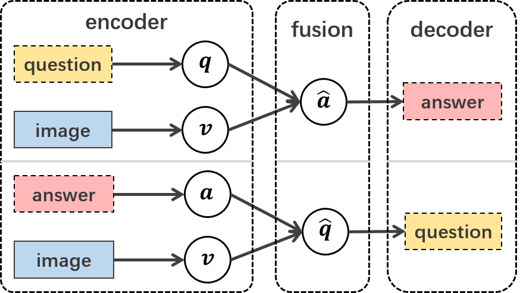
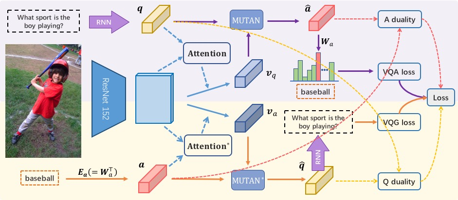
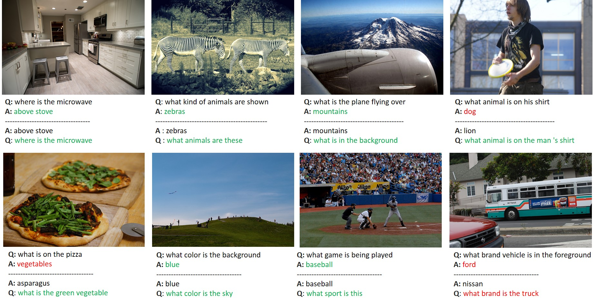

# Invertible Question Answering Network (iQAN)

This is the PyTorch implementation of our **Invertible Question Answering Network (iQAN)** proposed in [Visaul Question Generation as Dual Task of Visual Question Answering](http://cvboy.com/publication/cvpr2018_iqan/). Please follow the guidelines to run to the codes.

p.s. *This is just an initial version. More details will available soon.*


## Introduction

Both Visual Question Generation (VQG) and Visual Question Answering (VQA) tasks are training models in a end-to-end fashion on a multimodal dataset made of triplets:
- an **image** with no other information than the raw pixels,
- a **question** about visual content(s) on the associated image,
- a short **answer** to the question (one or a few words).

<p align="center">
    
</p>

As you can see in the illustration bellow, the problem solving schemes of VQA (top) and VQG (bottom) both utilize the *encoder-fusion-decoder* pipeline with *Q* and *A* in inverse order:
- an **encoder** to encode the question using an LSTM, GRU, or pretrained Skipthoughts, or the answer with an answer embedding table
- a **fusion scheme** which can be an element-wise sum, concatenation, [MCB](https://arxiv.org/abs/1606.01847), [MLB](https://arxiv.org/abs/1610.04325), or [Mutan](https://arxiv.org/abs/1705.06676),
- a **decoder** to predict the answer with a linear transform or to generate the question sequence with an LSTM, GRU.
- an **image model** which can be a pretrained VGG16 or ResNet-152,
- optionally, an **attention scheme** which may have several "glimpses".

<p align="center">
    
</p>

One of our claim is that VQA and VQG are two complementary tasks with isomorphoic settings, where the two could be viewed as the inverse form of each other. Thus, we formulate them as dual tasks and propose a dual training scheme, Invertible Question Answering Network (iQAN), to jointly train the model on VQA and VQG tasks. Our experimental results show that our proposed dual training scheme could make better use the annotated data by simultaneously training the model on two dual tasks.

## Summary:

* [Introduction](#introduction)
* [Installation](#installation)
    * [Requirements](#requirements)
    * [Submodules](#submodules)
    * [Data](#data)
* [Reproducing results on VQA 2.0 and CLEVR](#reproducing-results-on-vqa-20-and-clevr)
    * [Prepare Features](#prepare-features)
    * [Dual Training](#dual-training)
    * [Qualitative Results](#qualitative-results)
* [VQG as a way to augment Q/A pairs](#vqg-as-a-way-to-augment-qa-pairs)
    * [Training with partial data](#training-with-partial-data)
    * [Generate questions based on answers](#generate-questions-based-on-answers)
    * [Re-package an augmented dataset](#re-package-an-augmented-dataset)
    * [Pretrain](#pretrain)
    * [Finetuning](#finetuning)
    * [Results](#results)
* [Citation](#citation)
* [Acknowledgment](#acknowledgment)


## Installation

### Requirements

First install python 3 (we don't provide support for python 2). We advise you to install python 3 and pytorch with Anaconda:

- [python with anaconda](https://www.continuum.io/downloads)
- [pytorch with CUDA](http://pytorch.org)

```
conda create --name vqa python=3
source activate vqa
conda install pytorch torchvision cuda80 -c soumith
```

Then clone the repo (with the `--recursive` flag for submodules) and install the complementary requirements:

```
cd $HOME
git clone --recursive https://github.com/yikang-li/iQAN.git
cd iQAN
pip install -r requirements.txt
```

### Submodules

Our code has two external dependencies:
- [skip-thoughts.torch](https://github.com/Cadene/skip-thoughts.torch) is used to import pretrained GRUs and embeddings,
- [pretrained-models.pytorch](https://github.com/Cadene/pretrained-models.pytorch) is used to load pretrained convnets.

### Data

VQA 2.0 Data will be automaticaly downloaded and preprocessed when needed.

For [CLEVR](http://cs.stanford.edu/people/jcjohns/clevr/) dataset:
- Dowload the full dataset:
```
wget https://s3-us-west-1.amazonaws.com/clevr/CLEVR_v1.0.zip
unzip CLEVR_v1.0
mkdir -p data/clevr/annotations
cd data/clevr/annotations
ln -s /path/to/CLEVR_v1.0/questions/CLEVR_train_questions.json train.json
ln -s /path/to/CLEVR_v1.0/questions/CLEVR_val_questions.json val.json
cd ../
mkdir ln -s /path/to/CLEVR_v1.0/images raw
```

## Reproducing results on VQA 2.0 and CLEVR

### Prepare Features

#### From COCO

The needed images will be automaticaly downloaded to `dir_data` and the features will be extracted with a resnet152 by default.

There are three options for `mode` :

- `att`: features will be of size 2048x14x14,
- `noatt`: features will be of size 2048,
- `both`: default option.

Beware, you will need some space on your SSD:

- 32GB for the images,
- 125GB for the train features,
- 123GB for the test features,
- 61GB for the val features.

```
python extract.py -h
python extract.py --dir_data data/coco --data_split train
python extract.py --dir_data data/coco --data_split val
```

Note: By default our code will share computations over all available GPUs. If you want to select only one or a few, use the following prefix:

```
CUDA_VISIBLE_DEVICES=0 python extract.py
CUDA_VISIBLE_DEVICES=1,2 python extract.py
```


#### From CLEVR
```
python extract.py -h
python extract.py --dir_data data/clevr --data_split train --dataset clevr
python extract.py --dir_data data/clevr --data_split val --dataset clevr
```

### Dual Training

We apply our proposed Dual Training scheme on three models:

- [iBOWIMG](https://arxiv.org/abs/1512.02167): a simple baseline (Bag of Words + CNN)
- [MLB VQA](https://arxiv.org/abs/1610.04325): the previous state-of-the-art VQA method
- [Mutan VQA + skipthought](https://arxiv.org/abs/1705.06676): the current state-of-the-art with pretrained skip-thought as question encoder
- Mutan VQA + LSTM: the question encoder is changed to random-initialized LSTM model


All the corresponding model options is listed in ```options/dual_model/```. The model options for *CLEVR* dataset is in the subfolder ```CLEVR```.

#### Options
We have several options to enable/disable different settings:
- ```share_modules``` of the **.yaml**: whether to share the Attention and Fusion modules of VQA and VQG models. If we set that to ```False```, the two models are actually two separated models.
- ```--share_embeddings```: whether to share encoder/decoder of questions and answers.
- ```--dual_training```: whether to enable the regular terms **Q/A Duality** proposed in the paper.

#### Train models on VQA 2.0

Training the Mutan VQA with Dual Training scheme:

```
CUDA_VISIBLE_DEVICES=0,1 python train_dual_model.py --path_opt options/dual_model_MUTAN_skipthought.yaml --dual_training --share_embeddings
```

You can set the ```share_modules``` to ```False``` to train a baseline Mutan VQA model.
```
CUDA_VISIBLE_DEVICES=0,1 python train_dual_model.py --path_opt options/dual_model_MUTAN_skipthought.yaml
```

Training the MLB VQA with Dual Training scheme:

```
CUDA_VISIBLE_DEVICES=0,1 python train_dual_model.py --path_opt options/dual_model_MLB.yaml --dual_training --share_embeddings
```

Training the iBOWIMG VQA with Dual Training scheme:

```
CUDA_VISIBLE_DEVICES=0,1 python train_dual_model.py --path_opt options/dual_model_iBOWIMG.yaml --dual_training --share_embeddings
```

#### Train models on CLEVR
Training the Mutan VQA with Dual Training scheme:

```
CUDA_VISIBLE_DEVICES=0,1 python train_dual_model.py --path_opt options/CLEVR/dual_model_MUTAN_skipthought.yaml --dual_training --share_embeddings
```


#### Restart training

Restart the model from the last checkpoint.

```
python train.py --path_opt options/dual_model_MUTAN_skipthought.yaml --dir_logs logs/dual_model/iQAN_Mutan_skipthought --resume ckpt
```

Restart the model from the best checkpoint.

```
python train.py --path_opt options/dual_model_MUTAN_skipthought.yaml --dir_logs logs/dual_model/iQAN_Mutan_skipthought --resume best
```

#### Evaluate models on VQA

Evaluate the model from the best checkpoint.

```
python train.py --path_opt options/dual_model_MUTAN_skipthought.yaml --dir_logs logs/dual_model/iQAN_Mutan_skipthought --resume best -e
```

### Qualitative Results:

You can visualize the evalutation results with ```visualize_results.ipynb``` and ```visualize_results_CLEVR.ipynb``` on VQA 2.0 and CLRVR dataset respectively.

<p align="center">
    
</p>


### VQG as a way to augment Q/A pairs

#### Training with partial data
Here, we provide an additional option ```--partial``` to training the model with only part of the original dataset. If we set ```partial``` within the range (0, 1), it will use corresponding part of original training data. But the full validation dataset is still used for evaluation.

```
CUDA_VISIBLE_DEVICES=0,1 python train_dual_model.py --path_opt options/dual_model_MUTAN_skipthought.yaml --dual_training --share_embeddings --partial 0.5 --dir_logs logs/dual_model/iQAN_Mutan_skipthought_partial_0_5
```

#### Generate questions based on answers
Here, we should modify the code. Change evaluation data_loader to train_loader, from ```engine.evaluate(test_loader, model, exp_logger, args.print_freq)``` to ```engine.evaluate(train_loader, model, exp_logger, args.print_freq)```. Then run the evaluation command:

```
python train.py --path_opt options/dual_model_MUTAN_skipthought.yaml --dir_logs logs/dual_model/iQAN_Mutan_skipthought_partial_0_5 --resume best -e
```

#### Re-package an augmented dataset
We provide the scripts ```augment_data.ipynb``` to generate a new dataset with the latter part of the annotations changed to the augmented ones. ```start_index``` should correspond to the ```--partial```

Then replace the ```trainset.pickle``` at ```./data/vqa2/processed/nans,2000_maxlength,17_minwcount,10_nlp,nltk_pad,right_trainsplit,train_filter_questions/``` with newly generated ```augmented_trainset.pickle```.

#### Pretrain
We pretrain the model on the combined annotated half and augmented half.
```
CUDA_VISIBLE_DEVICES=0,1 python train_dual_model.py --path_opt options/dual_model_MUTAN_skipthought.yaml --dual_training --share_embeddings --dir_logs logs/dual_model/iQAN_Mutan_skipthought_augmented_pretrain
```

#### Finetuning
Then finetune the model with the clean (annotated) part, don't forget the enlarge the ```epochs``` enough for training:
```
CUDA_VISIBLE_DEVICES=0,1 python train_dual_model.py --path_opt options/dual_model_MUTAN_skipthought.yaml --dual_training --share_embeddings --partial 0.5 --dir_logs logs/dual_model/iQAN_Mutan_skipthought_augmented_pretrain --resume best
```

#### Results
This is the copy of the result table listed in the paper.

Result on cleansed dataset.

Model   |   Training Set |   Acc@1   | CiDEr |      Training Set |   Acc@1   | CiDEr |      
---------|:-------:|:--------:|:--------:|:-----: |:--------:|:-----:      
Baseline| 0.1  Q,A | 33.60     | 1.332 | 0.5  Q,A | 46.68     | 1.930
DT| 0.1  Q,A | 35.23     | 1.540 | 0.5  Q,A | 47.63     | 2.101
VQG+DT| 0.1  Q,A  + 0.9 A | 38.87| 1.528 | 0.5  Q,A  + 0.5 A | 47.99 | 2.072
VQG+DT+FT| 0.1  Q,A  + 0.9 A|**39.95**| **1.739** | 0.5  Q,A  + 0.5 A| **48.48** | **2.281**


## Citation

Please cite the arXiv paper if you use Mutan in your work:

```
@article{li2018iqan,
  author={Li, Yikang and
    Duan, Nan and
    Zhou, Bolei and
    Chu, Xiao and
    Ouyang, Wanli and
    Wang, Xiaogang and
    Zhou, Ming},
  title={Visual Question Generation as Dual Task of Visual Question Answering},
  journal={CVPR},
  year = {2018},
  url = {http://cvboy.com/publication/cvpr2018_iqan/}
}
```

## Acknowledgment

Special thanks to the authors of [MUTAN](https://arxiv.org/abs/1705.06676) for providing some [PyTroch](https://github.com/Cadene/vqa.pytorch), and Multimedia Lab of CUHK as well as Microsoft Research Asia for the computing resources and perfect working atmosphere.
